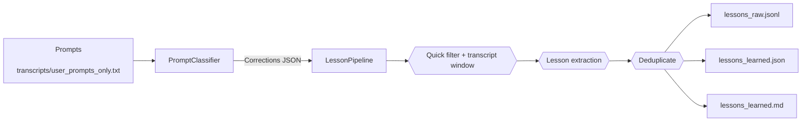

# Lessons Learned Toolkit

Extract durable guidance from Claude Code transcripts with a transport-agnostic, typed pipeline. The
project now follows a ports-and-adapters design so you can swap between the Claude CLI and the
Anthropic API without touching the core logic.

## Why this exists

- **Raw chat logs are noisy.** Claude sessions mix acknowledgements, link drops, and partial fixes with
  the genuine “do this differently next time” insights we care about. Manually sifting transcripts does
  not scale and the signal is inconsistent between engineers.
- **We need repeatable lessons.** Product and engineering reviews depend on a canonical stream of
  corrections and frustrations so we can spot recurring missteps (bad deploy hygiene, missing metrics,
  access gaps, etc.). Ad‑hoc summaries drift quickly.
- **Transports keep changing.** Sometimes the team runs the Claude CLI locally, sometimes we lean on the
  Anthropic API or Bedrock. A single pipeline should work regardless of transport so we can compare
  lessons over time.
- **Downstream artefacts must stay fresh.** The business consumes JSON/Markdown outputs to populate
  dashboards and weekly retros. A reproducible toolchain – with prompt extraction, classification,
  lesson generation, and dedupe – keeps those artefacts trustworthy.

This repository is the production-ready implementation of that flow: feed it Claude transcripts and it
spits out validated, deduplicated “lessons learned” that are safe to publish internally.

## Quick Start (uv)

```bash
cd lessons-learned
uv sync --extra dev      # install runtime + tooling
dotenv -q set LESSONS_TRANSPORT=cli  # optional convenience
uv run lessons-tk --help
```

All commands execute through `uv run …`. The `lessons_toolkit.cli` entrypoint stays thin: it loads
`ToolkitSettings`, builds adapters via the composition root, and delegates to domain services.

## Configuration & Settings

`ToolkitSettings` (backed by Pydantic v2 + `BaseSettings`) centralises runtime configuration. Every
field can be overridden via environment variables prefixed with `LESSONS_` or passed through the CLI.
Common knobs:

- `LESSONS_TRANSPORT=cli|api|bedrock` – select the Claude CLI, Anthropic Messages API, or AWS Bedrock runtime.
- `LESSONS_ANTHROPIC_API_KEY` (and optional `LESSONS_ANTHROPIC_BASE_URL`) for API mode.
- `LESSONS_CLAUDE_PROJECT_ID` – optional default Claude Code project used when pulling logs from
  `~/.claude/projects`.
- `LESSONS_CLAUDE_PROJECTS_DIR` – override the Claude projects root (defaults to
  `~/.claude/projects`).
- Bedrock mode honours standard AWS credentials (`AWS_ACCESS_KEY_ID`, `AWS_SECRET_ACCESS_KEY`, `AWS_SESSION_TOKEN`, named profiles) plus optional toolkit overrides (`LESSONS_BEDROCK_REGION`, `LESSONS_BEDROCK_PROFILE`, etc.). `ToolkitSettings` defaults point at Claude 4.5 model IDs; supply matching inference profile ARNs via environment variables when you run in your own AWS account. If you authenticate with a Bedrock API token, the toolkit will automatically call the inference profile endpoints so 4.x models work as expected.
- `LESSONS_PROMPTS_FILE`, `LESSONS_TRANSCRIPT_FILE`, `LESSONS_CORRECTIONS_FILE`, etc., to move
  artefacts.
- `LESSONS_CONTEXT_BEFORE` / `LESSONS_CONTEXT_AFTER` to tune transcript windows.

### Bedrock model identifiers

Recent Claude releases (4.0 and above) require **inference profile ARNs**, not the bare
`anthropic.claude-*-*-*` model IDs. `ToolkitSettings` keeps the 4.5 **model IDs** as defaults, but
you must override your environment with the inference profiles that exist in your account:

```
LESSONS_BEDROCK_REGION=<aws region>
LESSONS_BEDROCK_QUICK_PROFILE=<haiku inference profile arn>
LESSONS_BEDROCK_DEDUPE_PROFILE=<haiku inference profile arn>
LESSONS_BEDROCK_FULL_PROFILE=<sonnet inference profile arn>
```

Discover profile ARNs with:

```
aws bedrock list-inference-profiles --region <region> \
  --query 'inferenceProfileSummaries[].{name:inferenceProfileName,arn:inferenceProfileArn}'
```

Using the bare model ID (e.g. `anthropic.claude-haiku-4-5-20251001-v1:0`) without an inference
profile will trigger Bedrock error `400 Invocation of model ... with on-demand throughput isn’t
supported`.

Settings ensure that required directories exist (`prompts/`, `transcripts/`, `extracted_knowledge/`,
`config/`) and expose resolved `Path` objects for downstream adapters.

## Architecture Overview

- **Ports** – protocols describing behaviour (`ClaudePort`, `PromptRepository`, `TranscriptSource`,
  `LessonRepository`, `ClassificationRepository`, `StateRepository`, `StartFromRepository`).
- **Adapters** – filesystem repositories, the Claude CLI adapter (with explicit `# noqa` justifications
  for subprocess usage), and the Anthropic API adapter built on the official SDK.
- **Domain Services** –
  - `PromptClassifier`: concurrent classification with resilient JSON parsing.
  - `LessonPipeline`: quick filter → transcript window → lesson extraction → dedupe → artefact writes.
  - `TargetedLessonExtractor`: rebuild lessons directly from stored corrections for prompt iteration.
- **Models** – Pydantic v2 models capture prompts, classifications, lessons, state snapshots, and run
  summaries so invalid payloads fail fast.

Everything is wired via `ToolkitContainer`, which resolves settings, instantiates adapters, and hands
out fully-initialised services.

## CLI Commands

| Command | Purpose |
| --- | --- |
| `uv run lessons-tk extract-prompts --project-id <id>` | Pull `.claude` project logs, refresh transcript & prompt feeds (honours `config/start_from.txt` when `--since` omitted). |
| `uv run lessons-tk extract-prompts transcripts/all_sessions.json` | Legacy path: rebuild prompts from a JSON export. |
| `uv run lessons-tk projects` | List Claude Code projects detected under `~/.claude/projects`. |
| `uv run lessons-tk classify --limit 200` | Identify corrections / frustration. Supports CLI or API transport transparently. |
| `uv run lessons-tk run --quick-model claude-haiku-4-5 --dedupe-model claude-sonnet-4-5` | End-to-end pipeline producing JSONL/JSON/Markdown artefacts. |
| `uv run lessons-tk extract-lessons --corrections-file extracted_knowledge/correction_classifications.json` | Rehydrate lessons from stored corrections after prompt edits. |
| `uv run lessons-tk transcripts --output transcripts/all_sessions.txt` | Render Claude session JSONL files to text or prettified JSON. |

Each subcommand accepts `--help`, and all path/model flags override the defaults shipped in
`ToolkitSettings`.

## Pipeline Flow



The same services power API mode: swap `LESSONS_TRANSPORT=api` and supply an Anthropic API key to run
without the local CLI.

## Incremental Runs & State

- Persistent state lives at `extracted_knowledge/state.json` (typed via `StateSnapshot`).
- `config/start_from.txt` can seed the initial cutoff timestamp; it is ignored by git for safety.
- The classifier and pipeline both honour the resolved cutoff (CLI flag → state file → start-from).
- Each pipeline run appends a `RunLogEntry` with prompt counts, lesson totals, and ISO8601 timestamps.

## Prompt Templates

Long-form prompt text now lives in `prompts/*.txt` (one file per template). The filesystem template
repository caches content and keeps prompts out of the Python codebase, preserving Ruff line length
requirements. Override the directory with `LESSONS_PROMPTS_DIR` if you package alternative prompts for
CI or specialised runs.

## Development & Tooling

- `uv sync --extra dev` – install runtime + Ruff + Pyright + pytest.
- `just check` – run format check, Ruff lint, Pyright (strict), and pytest.
- `just fix` – apply Ruff formatting and autofixable rules before manual clean-up.
- `uv run pyright --verifytypes lessons_toolkit` – optional API surface checks.

Ruff runs with `select = ["ALL"]` (CPY001 intentionally ignored because large prompt files are stored
externally). Pyright operates in strict mode via `pyrightconfig.json`.

## Packaging

`pyproject.toml` relies on Hatchling; the build includes the `prompts/` directory so the package stays
self-contained. Install via `uv pip install .` or publish using the standard Hatch workflow.
